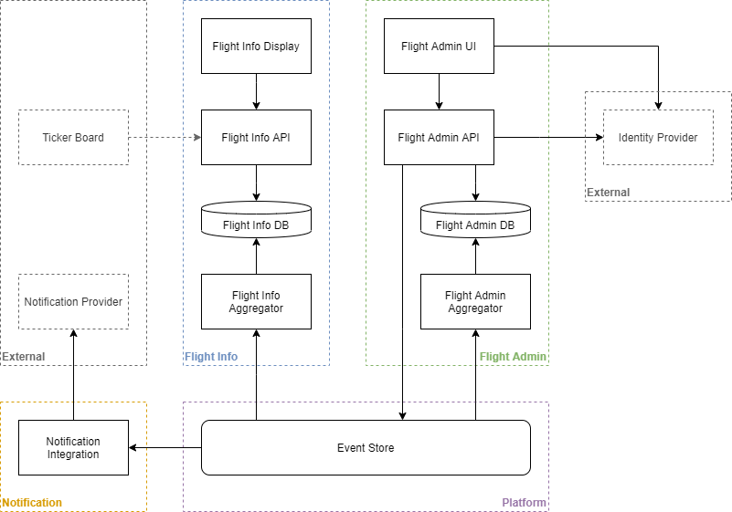
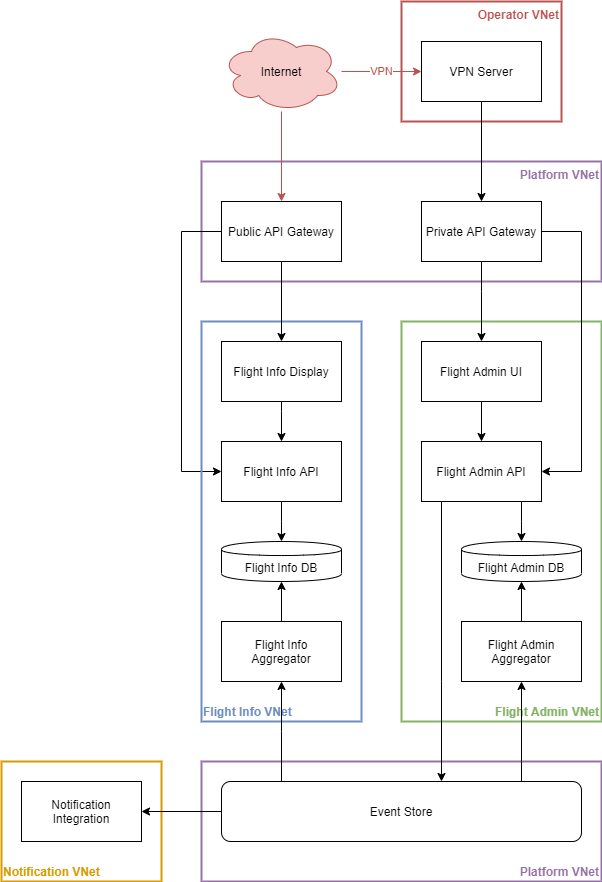

# Overview
This is a proposed solution design for a Flight Information Display system.
Total Estimate is 25 days to implement for 4 developers, 1 tester and 1 product owner.

## Requirements
- [x] Flight Scheduling - Admin Service can persist flight schedules
- [x] Flight Changes - Admin Service can persist changes
- [x] Flight Information Display - Info Service can display flight information
- [x] Flight Information API - Info Service provides HTTP endpoint for flight information
- [x] Public Flight Information Display - Info Website is exposed via a Public API Gateway
- [x] Scalable Flight Information Display - Info Website delivered via CDN and Gateway(LoadBalancer)
- [ ] Flight Push Notifications - Basic idea is there, but requires a lot more work
- [ ] Flight Data Isolation - Basic implementation, but can be improved with stricter tenant database and application instance isolation.
- [ ] Non-Public Flight Changes - Admin Service in Private Network accessible via VPN, but that's only 1 way to do it. Can do VPN tunnel to other networks, and probably a lot more ways. Needs more exploring

## Trade-offs
- Getting data from Admin to Display - Polling vs Event Based - Event based increases complexity but improves decoupling and performance
- Single vs Multiple APIs - Multiple APIs increases complexity, but improves decoupling, security diversity, performance
- Databases - MongoDB vs SQL - MongoDB loses some of the traditional comforts of SQL and it's tools, but we get amazing performance and scaling.
- Data Storage - State vs Event Sourcing - Event Sourcing allows us to scale up performance massively while maintaining consistency and transition over to an event based system.

## Assumptions
* Cloud environment for deployment
* Microsoft oriented stack is familiar or preferred
* Caching is not yet needed and can be introduced at a later stage
* The team members are in a productive setting/environment

## These are missing or need more work:
* We can't expect people to fill in the Airline name all of the time, so need to add Airline(Tenant?) management. Can also be used to store the Airline picture :)
* Infrastructure components
* Events, their details or flows
* Identity Provider and security
* Network details
* Service Levels
* Autoscaling of services
* Deployment pipelines

---
# Components


#### Common Tech
* `Docker` - For development and operational benefits.
* `OpenTelemetry -> Application Insights` - Fully managed telemetry for a good price. Can easily be swapped out of course!

#### Common Infrastructure
* `Private VNet` - All components are deployed to private networks to secure them.

---
## Flight Info Service
## **Flight Info Display**
The Flight Info Display is an internet facing website that displays the upcoming flight departures. It communicates with the Flight Info API over HTTP using JSON serialization.

```
AS A person
I WANT to view flight information over the internet
SO THAT I can check my flight status before coming to the airport
```

### Tech
* `HTML & Javascript` - The website needs to be lightweight and fast to render.

### Infrastructure
* `Public API Gateway` - Exposes the website to the internet
* `CDN` - Offload edge traffic to a content delivery network to optimize website performance and availability

### SLO's
* Availability - `>99.99% of requests 2XX`
* Performance - `>95% of requests <200ms`

## **Flight Info API**
The Flight Info API is an internet facing HTTP API that provides flight departure information.

### Tech
* `ASP.Net Core Web API` - We need some basic HTTP API functionality.

### HTTP Endpoints
// TODO

### Infrastructure
* `Public API Gateway` - Exposes the API to the internet

### SLO's
* Availability - `>99.99% of requests 2XX`
* Performance - `>95% of requests <50ms`

## **Flight Info DB**
We store all of the flight information ready for read-only display here. Old data automatically gets deleted.

### Tech
* `MongoDB -> CosmosDB` - We need a datastore that provides speed, scalability and TTL for data records.

### Models
**Flight Departure Information** - This collection contains documents that can be used by the API as-is and should not require additional processing before serving it in an HTTP request.
```JSON
[
    {
        "Airline": {
            "Name": "Air New Zealand",
            "Picture": "://image.com/air-new-zealand.png"
        },
        "FlightNumbers": ["NZ0128", "QF35"],
        "Destination": {
            "Code": "MEL",
            "Name": "Melbourne",
        },
        "DepartureTime": "06:32",
        "Status": "Boarding",
        "DepartureGate": "G1"
    }
]
```
**Flight Departure Status** - This collection contains a rolling snapshot of flight departure schedules and their current status. This data is used to project the optimized documents for the **Flight Departure Information**.
```JSON
{
    "Airline": {
        "Name": "Air New Zealand",
        "Picture": "://image.com/air-new-zealand.png"
    },
    "FlightNumbers": ["NZ0128", "QF35"],
    "Destination": {
        "Code": "MEL",
        "Name": "Melbourne",
    },
    "ScheduledDepartureDateTime": "06:30",
    "EstimatedDepartureDateTime": "06:32",
    "ActualDepartureDateTime": "",
    "Status": "Boarding",
    "DepartureGate": "G1",
    "CreatedAt": "2020-03-15T00:00Z",
    "UpdatedAt": "2020-03-17T06:15Z"
}
```

## **Flight Info Aggregator**
The Flight Info Aggregator updates the state in **Flight Status DB** based on events produced by the **Flight Admin Service**.

```
GIVEN a new flight event
WHEN it is relevant to the current departure window
THEN aggregrate it into "Flight Departure Information" and rebuild "Flight Departure Status"

GIVEN no new flight event
WHEN 5 minutes have passed
THEN rebuild "Flight Departure Status"

```

### Tech
* `.Net Core` - Enough to build an event processing application

### SLO's
* Availability - `>99.999% events processed successfully`
* Performance - `>99% of events should process in less than <50ms`

---
## Flight Admin Service
## **Flight Admin UI**
The Flight Admin UI is a privately accessed website that allows operators to login and manage flight schedules and statuses. It communicates with the Flight Admin API over HTTP using JSON serialization.

```
AS A airline employee
I WANT define flight schedules
SO THAT flight information can be recorded

AS A airline employee
I WANT capture flight changes
SO THAT we can keep a record of flight information
```

### Tech
* `VueJS` - The website needs crud and other basic UI support, but still remain light weight.

### Infrastructure
* `Private API Gateway` - Exposes the website to users with access to the Private VNet

### SLO's
* Availability - `>99.9% of requests 2XX`
* Performance - `>95% of requests <500ms`

## **Flight Admin API**
The Flight Admin API provides the operations needed for flight scheduling and management.

### Tech
* `ASP.Net Core Web API` - We need an HTTP API framework/library/language that can provide a rich toolset for building domain logic.

### Events
// TODO

### Security
The API expects an Authorization header with an **Access Token(JWT)** for each request. This Token will determine what data a user can access and what operations they can perform.

### Infrastructure
* `Private API Gateway` - Exposes the website to users with access to the Private VNet

### SLO's
* Availability - `>99.99% of requests 2XX`
* Performance - `>95% of requests <50ms`

## **Flight Admin DB**
We store all of the flight schedules and aggregated flight information. The collections have a **airline** field that is used for basic tenant isolation. Tenant validation occurs before writing the data. The collections can be split up so that each **tenant/airline** as it's own set of collections to further increase tenant isolation. This comes at the cost of greater complexity and costs.

### Tech
* `MongoDB -> CosmosDB` - We need a datastore that provides speed & scalability.

### Models
**Flight Departure Schedules** - Contains the schedules for flight departures.
```JSON
{
    "Airline": {
        "Name": "Air New Zealand",
        "Picture": "://image.com/air-new-zealand.png"
    },
    "FlightNumbers": ["NZ0128", "QF35"],
    "Destination": {
        "Code": "MEL",
        "Name": "Melbourne",
    },
    "DepartureTime": "06:30",
    "DepartureDays": ["Monday","Wednesday","Friday"],
    "CreatedAt": "2020-01-11T00:00Z",
    "UpdatedAt": "2020-01-11T00:00Z"
}
```
**Flight Departure Status** - This collection contains flight statuses based on schedules and events.
```JSON
{
    "Airline": {
        "Name": "Air New Zealand",
        "Picture": "://image.com/air-new-zealand.png"
    },
    "FlightNumbers": ["NZ0128", "QF35"],
    "Destination": {
        "Code": "MEL",
        "Name": "Melbourne",
    },
    "ScheduledDepartureDateTime": "06:30",
    "EstimatedDepartureDateTime": "06:32",
    "ActualDepartureDateTime": "",
    "Status": "Boarding",
    "DepartureGate": "G1",
    "CreatedAt": "2020-03-15T00:00Z",
    "UpdatedAt": "2020-03-17T06:15Z"
}
```
---
## Platform
## **Event Store**
This is where we store all of our events that are produced by Domain logic commands.
### Tech
* `NATS Streaming Server` -  High scale message broker and event store that can handle and persist all the events we can throw at it.

---
## Notification
## **Notification Integration - Integration**
The Notification Integration calls the Notification Provider whenever there is a flight status event.

### Tech
* `.Net Core` - Enough to build an event processing application

### SLO's
* Availability - `>99.999% events processed successfully`
* Performance - `>99% of events should process in less than <50ms`

---
# General
## Network


## Testing
All levels of the testing pyramid should be implemented for Application Code and Infrastructure Code:
* Static analysis and unit tests should be run with every push to source control
* Unit test coverage should be above 95%, excluding plumbing code
* Integration and end-to-end tests should run before a pull request is merged to master

## Deployment
Development should follow the [GitHub Flow](https://guides.github.com/introduction/flow/)(not GitFlow!) workflow and store all code in GitHub.
All deployments should be fully automated with these tools:
* CI/CD - GitHub Actions - Very easy, fast & secure
* Infrastructure - Terraform - Best way to declaratively code and deploy infrastructure
* Applications - Docker - Run the same application environment locally and in production with ease

---
# Estimation
There is a pretty equal distribution of work in all areas of development(Frontend, Backend, Infrastructure, Automation).

## Team
The team allows pairing options, skills overlap, and flexibility:
* FrontEnd Developer - 2
* Backend Developer - 2
* Tester - 1
* Product Owner - 1

## Numbers
|Component| Days |
|-|-|
|Setup & Automation|5|
|Flight Admin|10|
|Flight Info|10|
|~~Notification~~|N/A|
|||
|**Total**|**25**|
|||